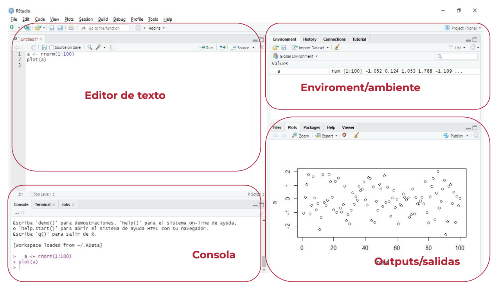
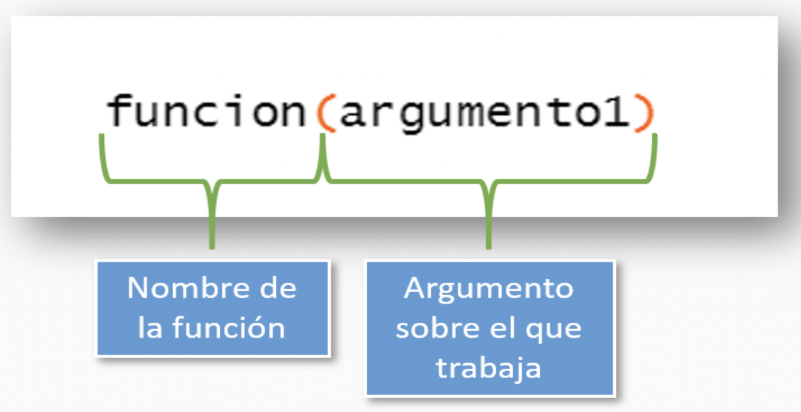
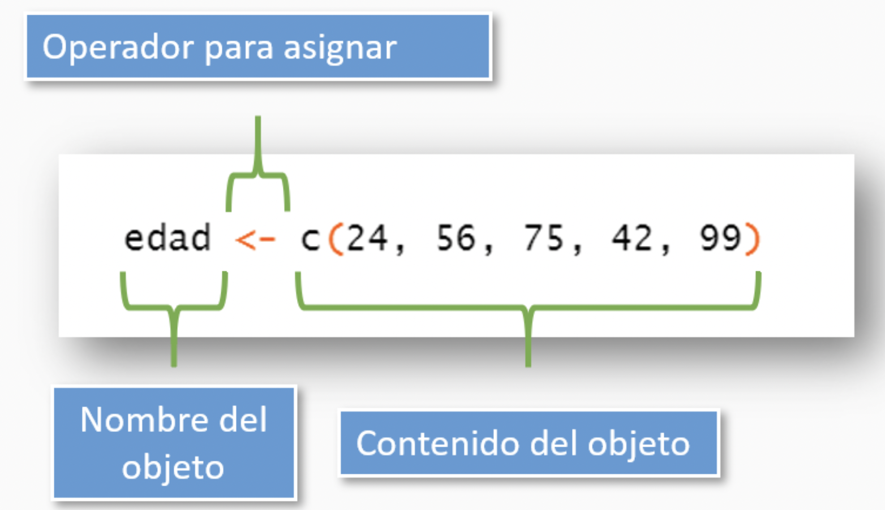
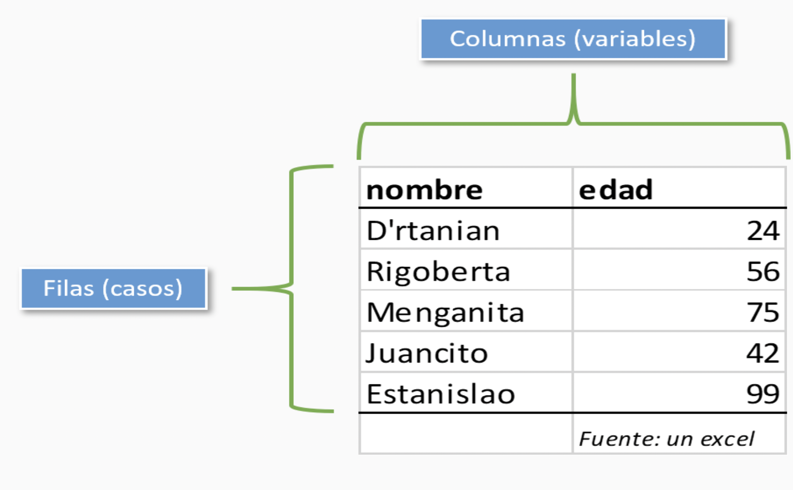
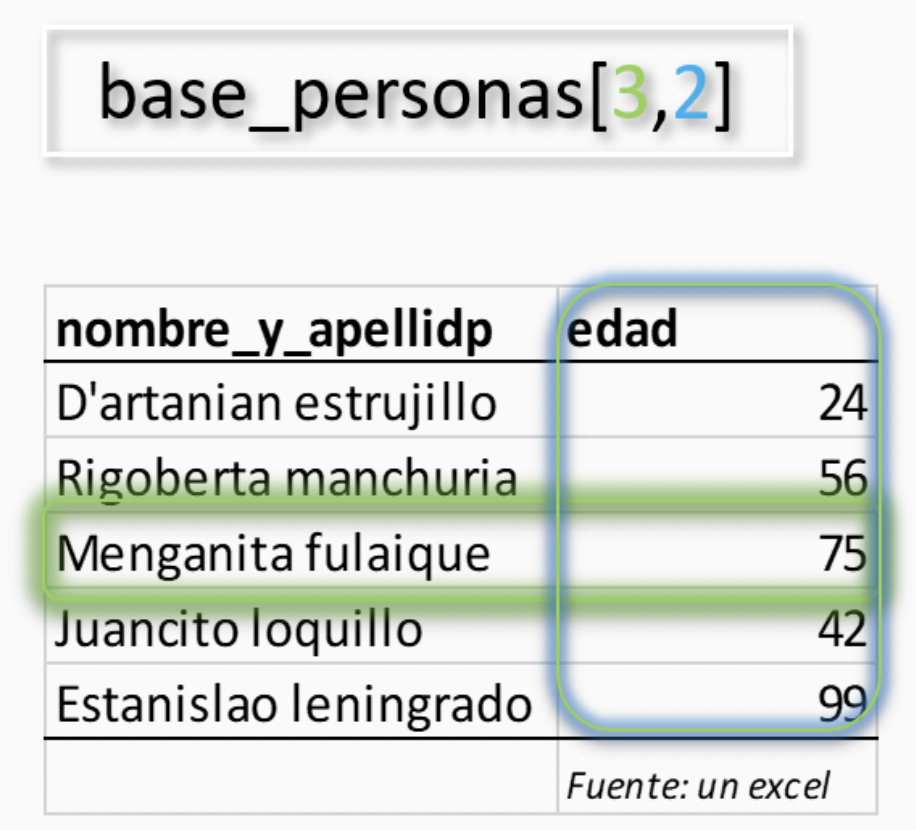

```{r setup, include=FALSE}
knitr::opts_chunk$set(echo = FALSE)
```

## ¿Quien soy?

[Franco Galeano](https://tartagalensis.netlify.app/)

- Made in Tartagal

- Politólogo en camino a Politólogo^2 (UTDT)

- Científico de Datos (En el Ministerio desde 09/2020)

## ¿Quiénes son ustedes?

- Nombre

- Background y formación previa

- Conocimientos previos sobre la materia

- Expectativas

## Modalidad de aprendizaje en clase

- Teoría

- Práctica acompañada

- Práctica individual (en clase y por aparte)

- Canal de comunicación oficial: [Slack](https://join.slack.com/t/observatoriop-osv2190/shared_invite/zt-140q0hivn-RAnltGFr2Y8QeKMwowHYmA)

## Sobre el programa

```{r, results='asis', echo = FALSE, warning=FALSE}

df <- data.frame(semana = c(1,2,3,4,5,6,7,8),
           contenido = c("Intro a R y R Studio", "Paquetes y Librerias", "Data Wrangling","ggplot2","Git+RStudio","Data Wrangling 2", "ggplot2 2", "RmD + Kable"))


knitr::kable(tibble::as_tibble(df))
```


## ¿Qué es R?

- R Lenguaje de programación de código abierto (software libre) enfocado en análisis
estadístico y visualización de datos.

- Creado por Ross Ithaka y Robert Gentelman (1991 a 1993)

- S -> R

- Nace en el Año 2000: 1.0V (4.1.2V Noviembre 2021)

- Nace el entorno de desarrollo integrado (IDE) R Studio (2011)

## Beneficios de R

- Multiplataforma (Win, Mac, Linux... PStation)

- Desarrollado por estadísticos para estadísticas

- Trabaja con vectores

- Potente herramienta para generar visualizaciones

- Funcionalidad de base + paquetes específicos

- Gran comunidad de usuarios colaborando (sobre todo en Ciencias Sociales)

- Gratuito

## ¿Qué es R Studio?

Es un entorno de desarrollo integrado (IDE), una interfaz para facilitarnos la
programación en R.

Algunas ventajas de su uso:

- Autocompletado.

- Resaltado de sintaxis.

- Visualización inmediata.

- Integración con GIT.

- Documentación y ayuda integrada.

- Posibilidad de realizar informes con RMarkdown y de trabajo colaborativo.

## Partes de RStudio


{#id .class width=100% height=100%}

## Interfaz de R Studio

- Editor de texto: En este panel podremos escribir/editar/ver los R script y los datasets.
- Consola/Terminal: Acá es donde se ejecutan los comandos redactados en el editor
(Editor).
- Environment: En este panel Rstudio nos muestra qué datasets y qué objetos (variables)
tenemos creadas en la memoria. Allí también podremos visualizar otras pestañas que
más adelante veremos.
- Outputs: Este es un panel multipróposito. En "Files" podemos navegar en nuestro
escritorio y seleccionar los archivos que deseamos. En "Plots" nos muestra los gráficos
que realicemos, y si son interactivos van a aparecer en "Viewer". En "Packages" se
pueden ver cuáles son los paquetes instalados o disponibles en nuestro equipo. Por
último en “Help” vamos a poder consultar dudas sobre funciones o paquetes.


## Consola/Términal - ¿Cómo conversar con R?

Los dos paneles de la izquierda son las dos formas principales de interactuar con R. El panel de abajo a la izquierda es la consola. Es el lugar que te permite conversar con R. Podés escribir comandos que se van a ejecutar inmediátamente cuando aprietes Enter y cuyo resultado se va a mostrar en la consola.

Por ejemplo, hacé click en la consola, escribí `2 + 2` y apretá Enter. Vas a ver algo como esto:

```{r}

2 + 2

```


##  Editor de texto/script

Ahora, lo que podemos intentar es guardar ese pedazo de código (nuestro 2 + 2) para editarlo, al mismo tiempo que podemos ejecutarlo (correrlo). Los resultados nos van a aparecer en la consola (cuando sea texto) o en el panel de salida (cuando hagamos gráficos).

Ventajas de utilización de Scripts:

● Ordena las instrucciones utilizadas.

● Permite guardar los diferentes comandos.

● En caso de algún cambio, se puede editar una parte del código.

● Permite replicar el código a utilizar.


##  Editor de texto/script (1)

Ahora, hacé click en el script, escribí `2 + 2`, selecciona todo el bloque de código y apretá Enter.

En la consola vamos a ver lo mismo que la vez pasada:

```{r}

2 + 2

```

## Recreo 5'

# VALORES

## Valores

En R la unidad mínima para trabajar son los valores:

- `1` es un valor (numérico),

- `"uno"` es un valor (cáracter),

- `"1"` es un valor (cáracter) y

- `"Esto es un uno"` también es un valor (cáracter).

## Usemos R como una calculadora

```{r, include=TRUE, echo=TRUE}

2 + 18
50821/6
21 ^ 2
log (4) / 9 ^ 2

```

## Vectores 

A un conjunto de valores lo llamaremos vector y R los interpretará bajo el comando c().

Los vectores, como los valores, también serán de un tipo determinado:

- Vector numérico (numeric)
c(1, 2, 3, 4, 5)
c(1:5)
- Vector de texto (character)
c("uno", "dos", "tres", "cuatro", "cinco")

# FUNCIONES

## Funciones

- La función es una operación que nos ayuda a resolver un problema que de otra forma llevaría más pasos/tiempo.

- Una función tiene nombre y suele (intenta) ser intuitivo respecto a la acción que realiza (el problema que resuelve). También comienza y termina con paréntesis (), donde se ubica el o los argumentos.

{#id .class width=60% height=60%}

## Funciones (1)

- Por ejemplo, la función class() evalúa el tipo (numérico, cáracter) de un elemento
Evaluemos de qué tipo es el valor 2

```{r, echo=TRUE}
class(2)
```

¿y el valor "dos"?
```{r, echo=TRUE}
class("dos")
```

## Funciones (2)

- Otras funciones nos permiten incluir más de un argumento. En este caso, cada uno de ellos se separa con una coma (,).
Por ejemplo, la función sum() permite sumar varios valores numéricos:
```{r, echo=TRUE}
sum(2, 5, 10)
```


La función paste0() permite pegar varios valores de tipo texto:
```{r, echo=TRUE}
paste0("Esto", "es", "un texto", "con", "seis", "valores")
```


## Funciones (3)

- Ciertas funciones también incluyen parámetros, los cuales agregan especificaciones que hacemos a la operación que realiza la función.
Por ejemplo, queremos una función que pegue los valores anteriores pero que los separe por un espacio. En este caso, la función paste() (sin el 0 al final) contiene un parámetro llamado sep =, que permite definir un separador entre cada argumento.

```{r, echo=TRUE}
paste("Esto", "es", "un texto", "con", "seis", "valores", sep = "_")

```

# EJERCICIOS

## Ejercicios

1. Sumar dos o más valores sin utilizar una función

2. Crear un vector numérico que contenga 7 valores

3. Crear un vector de texto que contenga 3 valores

4. Verificar de qué tipo es el valor "67" (comprobar con comillas y sin comillas)

5. Pegar dos o más valores de tipo character (texto), cada uno separado por un espacio en blanco

## Objetos

. En R el elemento más importante es el objeto. Tanto valores como vectores (y practicamente, cualquier elemento) pueden ser asignados a un objeto.

. Al objeto debemos definirlo por un nombre (elige tu propia aventura) y asignarle el contenido:


{#id .class width=60% height=60%}

## Objetos (1)

Al igual que valores y vectores, hay diferentes tipos de objetos:

- Objeto numérico (numeric)
```{r, echo=TRUE}
edad <- c(24, 56, 75, 42, 99)
```


- Objeto de texto (character)
```{r, echo=TRUE}
nombre <- c("D'rtanian", "Rigoberta", "Menganita",
            "Juancito", "Estanislao")
```

- (otro) objeto de texto (character)
```{r, echo=TRUE}
nombre_y_apellido <- c("D'artanian estrujillo", "Rigoberta manchuria", 
                       "Menganita fulaique", 
                       "Juancito loquillo", "Estanislao leningrado")
```

## Objetos (2)

- Para ver el contenido de un objeto, simplemente debemos escribir su nombre y ejecutar en el script o la consola

```{r, echo = TRUE}
edad
nombre_y_apellido
```

## Objetos (3)

### RECOMENDACIONES

- No se aceptan espacios. Por ejemplo un objeto llamado "nombre y apellido"

- No se puede empezar con un número: Objeto llamado "1_objeto"
- Evitar símbolos (&, ^, /, !) y acentos
- Evitar que objetos y funciones tengan el mismo nombre
- Nombrar todo espacio_con_guion_bajo (es más una convención)

# DATAFRAMES

## Dataframes

El elemento data.frame es lo que conocemos como una base de datos: Filas (casos) y columnas (variables) relacionadas entre sí:

{#id .class width=60% height=60%}

## Dataframes (1)

La función data.frame() nos permite crear una base de datos vinculando vectores:

```{r, echo = TRUE}
data.frame(nombre_y_apellido, edad)
```

Podemos guardarlo en un objeto:

```{r, echo = TRUE}
base_personas <- data.frame(nombre_y_apellido, edad)
```

## Dataframes (2)

Algunas funciones para trabajar con los data frames:

```{r, echo = TRUE}
dim(base_personas)
summary(base_personas)
```


## Navegando por objetos: Vectores

R base nos permite navegar entre los valores de un vector o data frame, y lo hace a través de []
- Supongamos que queremos extraer el 2do valor del objeto edad:

```{r, echo = TRUE}
edad <- c(24, 56, 75, 42, 99)
edad[2]
```

- Podemos guardar en un objeto dicho valor
```{r, echo = TRUE}
valor_2do <- edad[2]
valor_2do
```


## Navegando por objetos: Vectores (1)

Así como podemos consultarle a R por un valor en particular de un vector, también podemos usar el comando `[]` para editar ese valor:
```{r, echo = TRUE}
edad[2]
edad[2] <- 76
```

Chequeo el contenido de mi objeto edad

```{r, echo = TRUE}
edad
```

## Navegando por dfs

Supongamos que tenemos la siguiente base de datos:

```{r, echo = TRUE}
edad <- c(24, 56, 75, 42, 99)
nombre_y_apellido <- c("D'artanian estrujillo", "Rigoberta manchuria", 
                       "Menganita fulaique",  "Juancito loquillo", 
                       "Estanislao leningrado")
base_personas <- data.frame(nombre_y_apellido, edad)
base_personas
```


## Navegando por dfs (1)

Queremos extraer la edad de Menganita fulaique:
base_personas[3,2]

{#id .class width=60% height=60%}

## Navegando por dfs (2)

También podemos consultarle a R por los valores de una columna entera de nuestra base con el símbolo `$`:


```{r, echo = TRUE}
base_personas$nombre_y_apellido
```

Y aplicar una función sobre esa columna

```{r, echo = TRUE}
mean(base_personas$edad)
```


# EJERCICIOS

## Ejercicios

1. Crear un vector llamado distrito que contenga 5 valores (5 nombres de provincias)

2. Extraer el segundo valor del vector creado y asignarlo a un nuevo objeto

```{r, echo = TRUE}
#Dados estos vectores:
categoria <- c("Dip Nac", "Dip Nac", "Gobernador", "Senador", "Dip Nac")
eleccion <- c("PASO 2021", "PASO 2021", "Generales 2011", "Generales 2021", "PASO 2021")

```

1. Crear un objeto de tipo data.frame (base de datos) que contenga el vector creado (partido) más los dos propuestos (distrito y categoria).
2. Extraer columna categoria
2. Extraer del data.frame el valor de la tercera fila y segunda columna.


