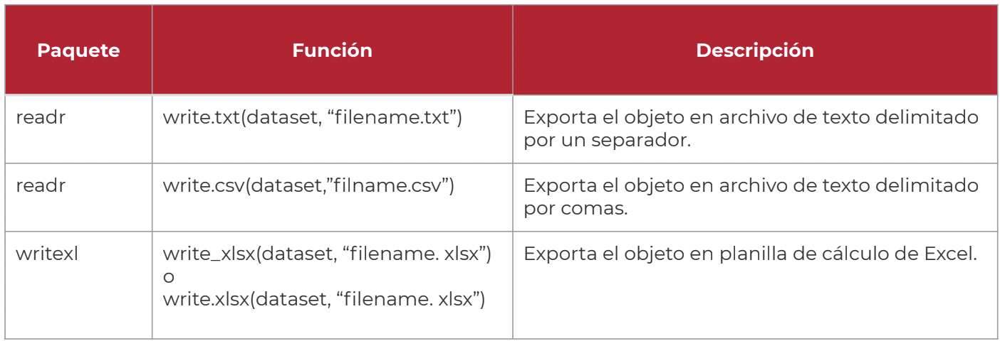

```{r setup, include=FALSE}
knitr::opts_chunk$set(echo = FALSE)
```

## ¿Qué vimos la clase pasada?

- Intro a R y RStudio

- Scripts

- Tipos de valores

- Vectores, Funciones y DataFrames

## ¿Qué veremos hoy?


- Instalación de paquetes y activación de librerías.

- Importar y exportar datos.

- Proyectos

- Funciones exploratorias.

- Fuentes para descargar datos.


# Paquetes 


## Paquetes

Un paquete (package) es una colección de funciones, datos y documentación que debemos cargar para poder expandir las herramientas de R.

En la web de R se puede consultar la lista de [paquetes "oficiales" disponibles](https://cran.r-project.o
rg/web/packages/avail
able_packages_by_na
me.html).


{#id .class width=60% height=60%}

## Librería != Paquete

Las librerías son conjuntos de instrucciones que albergan scripts que pueden ser ejecutados con instrucciones inherentes de la librería, en general, estas vienen contenidas dentro de paquetes que deben ser preinstalados para poder usarlas.


## ¿Cómo INSTALAR un paquete?

{#id .class width=70% height=70%}


## ¿Cómo ACTIVAR un paquete?

{#id .class width=70% height=70%}


## Bonus Track: Instalar paquetes desde Github

- **¿Qué es github?**
*Github* es un repositorio digital, básicamente un Google Drive para código. Gran parte de los paquetes que forman parte del repositorio oficial de R (CRAN) comenzaron su vida en github.

- Allí podremos encontrar paquetes que aún no están aprobados para ser parte de CRAN, así como también versiones de desarrollo (experimentales) con funciones nuevas o cambios que aún están siendo probados por los desarrolladores.

## Bonus Track: Instalar paquetes desde Github (1)

Si queremos instalar un paquete desde github podemos hacerlo a través del paquete
{devtools}

Para instalar paquete debemos correr: `install.packages(“devtools”)`

El archivo ReadMe suele tener información para el uso y descarga del paquete. El formato suele ser:
`devtools::install_github(”usuario/repositorio”)`

Luego llamamos a los paquetes como veníamos haciendo antes
`library(paquete)` y luego la función que necesitemos.

# Importar datos

## Importar datos

- Fijarnos qué *tipo de archivo* queremos importar (csv, xlsx, txt, etc.)

- Elegimos la *función* que vamos a usar para importar ese archivo.

a) Si el archivo está en nuestro equipo, es recomendable que esté alojado en la carpeta de nuestro proyecto. Recordatorio: consultemos a R donde está nuestro directorio de trabajo con getwd() y si es necesario establezcamos una nueva ruta con setwd()

b) Si el archivo está subido en algún portal web, podemos descargarlo en nuestro equipo o copiar la ruta de descarga y pegarla en la función que vamos a usar en R.

## Importar un .csv

Utilizaremos la base de datos de elecciones 2021 de Salta

{#id .class width=100% height=100%}


En el script de clase van a ver como importar online

## Algunas funciones para importar datos

{#id .class width=100% height=100%}

## Algunas funciones para importar datos (1)

{#id .class width=100% height=100%}


## MUY IMPORTANTE

Tener en cuenta la ruta por la cual compartimos el archivo.

`base_salta21 <- read_csv("~/Documents/Ministerio_Interior/OPE_intro_a_R/clase_2/data/escrutinio_generales_Salta2021.csv")`

- Si se la compartimos a otra persona, **se rompe**

- Si cambiamos de computadora, **se rompe**

- Si lo cambiamos de lugar, **se rompe**

# PROYECTOS

## Paso a paso

{#id .class width=100% height=100%}

## Paso a paso (1)

{#id .class width=100% height=100%}

## Proyectos y hojas de ruta

Es la mejor forma de trabajar con Rstudio. Cada proyecto permite segmentar sólo la
información y recursos útiles en una misma carpeta (directorio) de trabajo.

Utilizar proyectos nos permite continuar las tareas desde donde las dejamos la última vez al terminar una sesión. Es sólo cuestión de recuperar el proyecto deseado la próxima vez que abrimos RStudio, cliqueando en 
`File -> Recent Projects -> "Mi_proyecto"`

Importante: Antes de crear un proyecto, siempre verifiquemos en que carpeta estamos. Es recomendable tener todos los proyectos de R organizados como subcarpetas de un mismo directorio. (Ver archivo como_nombrar_cosas)

## Proyectos y hojas de ruta (1)

Ventajas:

- Le indicamos a R dónde "vive" nuestra carpeta de trabajo

- La ruta ya no contiene ninguna referencia personal que impida ser abierto en otra computadora

**RECOMENDACION**

**SIEMPRE** TRABAJAR CON PROYECTOS

## Ejemplo de proyecto

{#id .class width=100% height=100%}

# EJERCICIOS 

## EJERCICIOS

1. Crear una carpeta donde alojar el proyecto de trabajo

2. Crear una estructura de carpetas similar a la propuesta de ejemplo

3. En la carpeta **data** incorporar la base de datos provista

4. Crear un script de trabajo y alojarlo en la carpeta **script**


# BREAK 5'


# FUNCIONES EXPLORATORIAS


## FUNCIONES EXPLORATORIAS

{#id .class width=100% height=100%}

## OTRAS FUNCIONES EXPLORATORIAS

Prueben utilizando `head()`, `tail()`, `names()` y `View()`

¿Que tarea realizan estas funciones?


## También podemos manipular nuestra base de datos

{#id .class width=100% height=100%}

## También podemos exportar los datos

{#id .class width=100% height=100%}

# MANOS A LA OBRA

## Ejercicios (1)

1. Leemos la base de datos 

2. Utilizamos algunas de las funciones exploratorias propuestas

3. Describimos brevemente la base de datos (tip tiene NAs? podemos describir estadisticamente alguna columna?)

4. Extraemos todos los registros de las columnas 1,3,5,6,9 y 10. Guardarlo en un nuevo dataframe.

5. Exportaremos ese dataFrame como un archivo .csv


## Luego de clase

1. Seleccionar una base de datos de su interés y crear un proyecto 

2. Importar el archivo y aplicar funciones descriptivas.

3. Guardar códigos ejecutados en un script

4. No olvidar comentar cada paso utilizando los `#`

5. Enviarlo por Slack.

